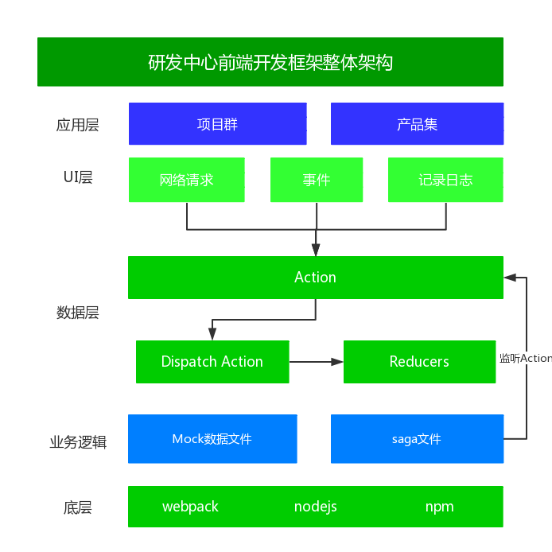

<!--
 * @Author: zhangb
 * @Date: 2019-11-14 11:05:59
 * @Email: lovewinders@163.com
 * @Last Modified by: zhangb
 * @Last Modified time: 2019-12-12 17:04:05
 * @Description: 
 -->

# 技术线研发中心前端技术方案

## 目录
*   [产品概览](#产品概览)
*   [产品特色](#产品特色)
*   [技术选型](#技术选型)
*   [目录结构](#目录结构)
*   [开发环境](#开发环境)
*   [生成框架](#生成框架)
*   [Mock数据](#Mock数据)
*   [部署模式](#部署模式)
*   [浏览器兼容](#浏览器兼容)
*   [开发指南](#开发指南)
*   [扩展功能点](#扩展功能点)
*   [更新记录](#更新记录)
*   [技术支持](#技术支持)

### 产品概览

> 产品简介

*   本产品相比create-react-app更加灵活配置，更贴切当前产品与项目的需求。
*   从0到1搭建产品/项目是非常耗时的，那么这个时候我们就迫切的需要一个前端脚手架。
*   一个 [灵活] [易用] 的前端脚手架往往能提升很大的前端开发效率，首先解决跨部门之间的技术架构选型不一致导致后来开发者接手需要短期内的学习磨合，其次技术规范的不一致导致后来开发者接手需要短期内的熟悉磨合。
*   作为开发人员，更应该专注于业务层的开发，而非工具层面重复性的高频次造轮子。
*   统一前端脚手架能将开发人员从繁琐的项目配置和构建中解放出来。

> 产品架构图



### 产品特色

> 高复用 低耦合 规范化 配置化 易用化
*   开箱即用的中台前端/设计解决方案
*   支持多种开发环境；例如：`开发` `测试` `生产`
*   统一的编码规范；
*   统一的目录结构；
*   统一的处理流程；异步请求/事件处理；
*   支持Mock的数据（2种模式）；
*   支持页面强制缩放功能；
*   支持typescript/javascript并存；
*   支持SPA/SSR服务端渲染模式；
*   支持灵活配置webpack打包；
*   支持开发环境热更新模式；
*   前沿的技术栈；

### 技术选型

>   常用选型
*   webpack：模块资源打包工具；
*   es6+（7/8/9/next）：使用JavaScript语言的最新特性；
*   react：构建用户界面；
*   react-router：基于react的路由管理中间件；
*   connected-react-router：给redux绑定路由的；
*   react-saga：处理异步请求；
*   redux：数据流状态管理；
*   sass：css预处理器；
*   classnames：动态处理className的轻量工具库（很好用）；
*   @hysight/fetch：处理普通http请求；
*   socket.io-client：处理socket请求；
*   mockjs：模拟api数据；
*   loadsh：工具集；
*   d3js/g2：绘制定制化图表/关系图；
*   echarts/zRender/g2：绘制基础图表或特殊图表；
*   therejs：绘制2D/3D定制化酷炫图，更适合酷炫的三维图表定制化开发；
*   eslint：校验前端编码规范；

>   其他选型(可选)

*   immutablejs：数据不可变集合；
*   redux-undo：时间旅行（前进/回退状态管理）；
*   html2canvas：将HTML内容写入cnavas生成图片；

### 目录结构

>   遵循深入react技术栈书籍推荐的目录结构
```
    - app    // 源码
        - api    // 异步fetch层
            - RouteA    // views/containers/constant/sagas/reducer 一一对应
                index.ts    // export 导出api对象
        - components    // 可复用普通组件（有状态组件/无状态组件）
            - ComponetA    // 采用首字母大写
                - index.tsx    //
                - style.scss
                - images    // 图片采用就近引入原则
        - config    // 配置
        - constant    // 常量
            - RouteA    // 采用首字母大写，views/containers/constant/sagas/reducer 一一对应
                -index.ts    // export 导出reducer/saga常量
        - containers    // 容器组件
            - RouteA    // 采用首字母大写，views/containers/constant/sagas/reducer 一一对应
                - index.ts    // 容器组件或仅限当前RouteA下除components之外的其他细分组件
                - style.scss
                - images    // 图片采用就近引入原则
                或 // 如果需要继续拆分组件，可如下
                - RouteAContainerA
                - RouteAContainerB
                - RouteAContainerC
        - reducer    // 更新数据state
            - index.ts   // 合并reducers入口
            - RouteA    // 采用首字母大写，views/containers/constant/sagas/reducer 一一对应
                - index.ts
        - sagas    // 处理异步请求
            - index.ts   // 合并sagas入口
            - RouteA    // 采用首字母大写，views/containers/constant/sagas/reducer 一一对应
                - index.ts
        - store    // 创建唯一的store
        - styles    // 全局样式
            - index.scss    // 全局性css配置
            - reset.scss    // 重置浏览器默认全局css
        - types    // 全局ts的type
        - utils    // 工具函数集合
        - views    // 视图层
            - App    // views主入口
                - index.tsx    // 文件命名采用index.tsx
                - style.scss    // 文件命名采用style.scss
                - images    // 图片采用就近引入原则
            - RouteA    // 采用首字母大写，views/containers/constant/sagas/reducer 一一对应
                - index.tsx
                - style.scss
        - favicon.ico    // ico
        - index.html    // html模板
        - index.tsx    // app主入口
    - build    //
        - config
            - environments.config.js    // 开发/生产模式对应的变量
            - product.config.js    // 产品打包过程中涉及到的变量
            - webpack.config.js    // webpack主入口配置
            - webpack.config.dev.js    // 开发环境webpack配置
            - webpack.config.pro.js    // 生产环境webpack配置
            - webpack.config.lib.js    // 第三方库入口配置
        - scripts
            - compile.js    // webpack编译debug模式
            - dev-server.js    // express结合webpack启动开发server
        - server    // ssr模式
    - dist    // webpack打包后编译出的文件
    - mock    // mock server 服务
    - public    // 全局公共静态文件，例如全局iconfont，公共静态资源
    - .babelrc    // babel配置
    - .browserslistrc    // 浏览器兼容版本
    - .gitignore    // git忽略文件配置
    - deploy-server    //
    - package.json    // 模块依赖配置
    - postcss.config.js    // postcss
    - tsconfig.json    // tsconfig
    - tsconfig.server.json    //
    - tslint.json    // tslint

```

### 开发环境

> [![node][node]][node-url]

> [![yarn][yarn]][yarn-url]

> [![npm][npm]][npm-url]

### 生成框架

> 通过git地址下载代码，然后按照顺序执行下列命令
```
    $ git clone https://github.com/hysight/typescript-rc-ssr-cli

    $ cd <project name>

    $ npm install

    $ npm run dll    // 打包第三方库，仅限初次运行，若运行过请执行下一步

    $ npm run start    // 客户端SPA模式渲染-启动完毕后会自动打开默认浏览器
```

> 启用服务端SSR模式渲染
```
    $ npm run start:ssr
```

> 其他scripts命令解析
```
    $ npm run clean    // 移除dist文件夹及其内容
    $ npm run compile    // webpack打包编译
    $ npm run analysis    // 以矩形树图的形式查看代码引用分析图
```

### Mock数据

> 方式一：启用mock服务（推荐）

#### 设置mock/api规则如下：

```
    // 路径app/config 案例
    - app
        - config
            - api.ts
                ...

                // 若isForceMock = true和isForceApi = true都为true，则优先取强制所有接口走真实api

                // 是否强制性所有接口走mock
                export const isForceMock = false; // true 表示开始强制所有接口开启mock, false表示默认走app/*/index.ts里的isMock属性

                // 是否强制性所有接口走api
                export const isForceApi = false; // true 表示开始强制所有接口走真实api，false表示默认走app/*/index.ts里的isMock属性

                ...

    // 路径app/api 案例
    - app
        - App/*其他异步
            // 以下划重点
            - api
                - index.ts
                    // 内容
                    import Fetch from '@hysight/fetch';

                    interface ApiProps {
                        fetchUserInfoData: () => void;
                    }

                    const Api: ApiProps = {
                        // 查询用户基本信息
                        fetchUserInfoData() { // index.ts与mock/index.ts与api/index.ts的key必须一致

                            return Fetch('/api/{version}/admin/info')
                                .then((res) => res)
                                .catch((err) => {

                                    console.log(err);

                                });

                        },
                    };

                    export default Api;
            - mock
                - index.ts
                    // 内容
                    import Mock from 'mockjs';
                    import { transformMockData } from 'app/utils/proxyApiMock';

                    interface ApiProps {
                        fetchUserInfoData: () => void;
                    }

                    const Api: ApiProps = {
                        // 查询用户基本信息
                        fetchUserInfoData() { // index.ts与mock/index.ts与api/index.ts的key必须一致

                            return transformMockData(Mock.mock({
                                'code': 1,
                                'msg': 'success',
                                // 属性 list 的值是一个数组，其中含有 1 到 10 个元素
                                'result': [{
                                    adminLock: 0,
                                    id: '@id',
                                    nickName: '@cname',
                                    phone: '135012345678',
                                    roleModels: [
                                        {
                                            operationList: ['LOOK', 'TEMPLATE_COMMENT', 'TEMPLATE_PUSH', 'TEMPLATE_APPLICATION'],
                                            resourcefulState: 'DEFAULT',
                                            serviceModel: 'DASHBOARD',
                                            serviceModelMenu: ['DEFAULT']
                                        }
                                    ]
                                }]
                            }));

                        },
                    };

                    export default Api;
            - index.ts
                // 内容
                import proxyApiMock from 'app/utils/proxyApiMock';

                import api from './api';
                import mock from './mock';

                interface ApiProps {
                    fetchUserInfoData: any;
                }

                const Api: ApiProps = {
                    // 查询用户基本信息
                    fetchUserInfoData: { // index.ts与mock/index.ts与api/index.ts的key必须一致
                        isMock: true,
                        // apiDataFn不设置的话，默认找同级文件同key，也可手动指定其他api的function key，若设置会覆盖自动查找同级文件同key
                        // apiDataFn: api.fetchSourceListData,
                        // mockDataFn不设置的话，默认找同级文件同key，也可手动指定其他api的function key，若设置会覆盖自动查找同级文件同key
                        // mockDataFn: mock.fetchSourceListData,
                    },
                };

                export default proxyApiMock(Api)(api, mock);
```

#### 调用mock/api规则-可2种模式

    模式1：saga中调用mock

```

    // 查询用户信息
    export function * getUserInfo(action): SagaIterator {

        try {

            ...

            // saga中调用方式
            const {data} = yield call(Api.fetchUserInfoData);

            ...

        } catch (err) {

            console.log(err);

        }

    }

```

    模式2：组件内直调mock

```
    import Api from 'app/api/Login';

    ...

    # 划重点：因Api返回的是Promise，所以有3种语法方式可以直接调用mock数据，例如promise/generator/async

    // 方式1
    const toLogin = (data) => {

        Api.fetchLoginData(data).then((res) => ...)

    };

    // 方式2
    const toLogin = function*(data) {

        const result = yield Api.fetchLoginData(data).then((res) => ...)

    };

    // 方式3-推荐这种
    const toLogin = async (data): Promise<any> => {

        // 早期无mock直接调用api方式
        // Fetch('/api/{version}/admin/auth/login', {
        //     method: 'POST',
        //     headers: {
        //         'Content-Type': 'application/json',
        //         'X-Token': '',
        //     },
        //     data
        // })
        //     .then(({ data: {result} }) => {

        //         // debugger;
        //         const {
        //             tokenState: { access_token: token }
        //         } = result;
        //         // 设置token
        //         localStorage.setItem('token', `AUTH_HEADER ${token}`);
        //         Fetch().default.headers['X-Token'] = `AUTH_HEADER ${token}`;

        //         props.history.push('/space');

        //     })
        //     .catch(err => {

        //         console.log(err);

        //     });

        // 现在有mock直接调用api方式
        const {data: {code, result}} = await Api.fetchLoginData(data);
        // 判断是否成功
        if(code === 1) {

            const {
                tokenState: { access_token: token }
            } = result;
            // 设置token
            localStorage.setItem('token', `AUTH_HEADER ${token}`);
            Fetch().default.headers['X-Token'] = `AUTH_HEADER ${token}`;
        
            props.history.push('/space');
        
        }


    };

    ...

```

> 方式二：启用mock server服务
```
    $ npm run mock:server    // 启用mock数据

    // 自定义mock如下
    // 路径mock/*
    - mock
        - api
            - *.controller.js // 自定义controller，涉及到的参数类型等都同真实后端api一致
        - router
            - *.router.js // 自定义router，涉及到的参数类型等都同真实后端api一致
        - index.js // 合并自定义的router

```

### 部署模式

> 手动开发/生产环境代码打包，运行完毕后代码在dist里，建议手动部署采用PM2，然后可通过浏览器ip:port/url访问
> 本产品可多种模式部署，

*   可部署在linux/window/docker/*等操作环境
*   可部署在node/tomcat/*等运行环境，建议统一优先部署在node环境中，以node LTS版本为准；
*   生产环境直连API服务，案例路径：app/config/api.ts
```
    // 生产环境-主IP
    const pro = {
        ip: '192.168.94.156',
        port: 8020,
    };
```
*   生产环境也可考虑不写ip，所有接口全部走代理，例如Nginx/node代理
```
    // 生产环境-主IP
    const pro = {
        ip: '',
        port: '',
    };
```
*   设置完毕后运行以下script命令打包

```
    $ npm run deploy:dev    // 开发-未压缩/未混淆
    或
    $ npm run deploy:prod    // 生产-压缩/混淆
```
*   优先采用[PM2](https://pm2.keymetrics.io/docs/usage/pm2-doc-single-page/)部署
```
    - node_modules
    - package.json
        {
            "author": "HIYNN",
            "dependencies": {
                "express": "^4.16.2"
            },
            "description": "部署",
            "devDependencies": {},
            "keywords": [
                "部署"
            ],
            "license": "ISC",
            "main": "index.js",
            "name": "server",
            "scripts": {
                "server": "node server.js"
            },
            "version": "0.0.1"
        }
    - deploy-server.js
        const path = require('path');
        const express = require('express');
        // const proxy = require('http-proxy-middleware');
        const compression = require('compression');

        const app = express();

        // gzip
        app.use(compression());

        // server static resource
        app.use(
            express.static(path.join(__dirname, 'server'), {
                maxAge: 30 * 24 * 60 * 60 * 1000,
                setHeaders: (res, path, stat) => {

                    res.set('Access-Control-Allow-Origin', '*');

                }
            })
        );

        // Unmatched static resource, redirect to index.html ->  router
        app.use('*', (req, res) => res.sendFile(path.join(__dirname, 'server', 'fe', 'index.html')));

        // compiler
        app.listen(3034, function(err) {

            if(err) {

                console.log(err);
                return;

            }
            console.log(
                '--====> 💻 start data Listening at Open http://localhost:3034 <====----'
            );

        });
    - fe // build下的文件夹

```
*   运行pm2命令
```
    $ npm install pm2 -g // 首次需要安装pm2，安装完毕请忽略，执行下一步
    $ pm2 start deploy-server.js --name fe-server
    $ pm2 ls // 可以查看当前PM2启动的任务服务列表
```

> 当前根目录下一键生产环境快速部署（基于PM2），然后可通过浏览器ip:port/url访问
```
    $ npm run deply:server
```

### 浏览器兼容

> Chrome

> Mozilla

> Safari

> Edge/IE (视情况而定兼容IE版本)

### 开发指南

> 开发过程中目录结构必须统一，下面从一级目录和app目录下的二级目录层面分别进行介绍

#### 一级目录：

|  目录名  |  作用  |  备注  |
|  :--------  |  :-----  |  :----  |
|  app  |  源码  |  -  |
|  build  |  打包编译的脚本  |  -  |
|  dist  |  打包后的文件  |  使用该文件夹中的内容部署  |
|  mock  |  启动mock服务  |  -  |
|  public  |  公共静态资源  |  常用于iconfont字体/全局通用资源  |

#### 二级目录：

|  目录/文件  |  作用  |  备注  |
|  :--------  |  :-----  |  :----  |
|  api  |  异步请求api/mock  |  -  |
|  components  |  普通组件（有状态/无状态）  |  复用普通组件，一般props数据通过views或containers中组件传递  |
|  config  |  配置项  |  全局配置项与各子模块配置项  |
|  constant  |  action常量  |  -  |
|  containers  |  容器组件  |  具有业务逻辑的组件或connect高阶组件  |
|  reducers  |  接收action和新state，返回处理后的 state  |  -  |
|  sagas  |  业务逻辑、网络请求处理  |  区别于redux-thunk，统一使用saga管理异步请求  |
|  store  |  统一的数据源  |  加入了redux-saga、redux-logger等中间件的处理 |
|  styles  |  全局样式  |  浏览器初始化样式/全局通用样式  |
|  types  |  全局ts类型  |  -  |
|  utils  |  工具类  |  例如一些工具函数，fetch/zoom/*  |
|  views  |  视图  |  一级路由视图层入口  |
|  favicon  |  favicon  |  浏览器tab选项卡小图标  |
|  index.html  |  应用程序HTML模板文件  |  -  |
|  index.tsx  |  应用程序主入口文件  |  -  |

> 开发过程中代码规范必须统一（采用eslint recommended + 自定义rules进行校验）

#### VSCode中配置eslint步骤如下,在VSCode中保存代码时能快速修复错误的代码规范
*   Extensions（VSCode左侧边栏第5个图标），搜索ESLint，然后install安装
*   VSCode编辑器 -> File -> Preferences -> Settings -> search(eslint) -> edit in settings.json
*   复制粘贴以下代码到settings.json中，然后重启VSCode即可生效（ctrl + shift + p调出搜索面板，输入reload window回车即可快速重启）
    ```
        "eslint.autoFixOnSave": true, // 保存时自动校验并修复文件eslint
        "eslint.validate": [
            "javascript",
            "javascriptreact",
            {
                "language": "typescript",
                "autoFix": true
            },
            {
                "language": "typescriptreact",
                "autoFix": true
            },
            { 
                "language": "html", 
                
                "autoFix": true 
            },
        ],
    ```

> 开发过程中css命名规范必须统一，以文件夹为模块单位，采用约定大于配置方式

-   className自定义名称设定以 [hv-*](#views案例方式) / [hm-*](#containers案例方式) / [hc-*](#components案例方式) / [hy-*](#其他全局案例方式) 4种方式之一，且是该文件夹模块唯一暴漏全局的className（其他子类className需写在4种方式之内）避免className污染全局；

-   className多个单词，单词字母采用全部小写+中横线拼接方式，文件夹名称与className后缀单词名称一致；

-   className尽量采用多个单词拼接写法

```
    // 不推荐写法
    .hc-upload {
        .name { // name/title/* 属于高频次命名单词，易受其他模块的className影响
            ....
        }
    }

    // 推荐写法
    .hc-upload {
        .upload-name { // 推荐的地方-前缀上模块名称
            ...
        }
    }

    或
    
    // 不推荐写法-css层级嵌套太深
    .hc-upload {
        .upload-container {
            .upload-header {
                .upload-layout {
                    .upload-text {
                        ...
                    }
                }
            }
        }
    }

    // 推荐写法-嵌套推荐2-3层即可
    .hc-upload {

        .upload-text {
            ...
        }
        或
        .upload-header {
            .upload-text {
                ...
            }
        }
    }
```

-   className禁止设定无意义字母/数字，例如错误示范：hy-a/hy-123/hc-a1等；
-   产品/项目同时多人协同开发时，禁止未经其他成员协商同意而`全局`擅改第三方UI库的className样。如果需要局部更改第三方UI库样式时，可采用外层嵌套上述4种全局className再更改第三方UI库className样式；

##### views案例方式：

*   views内以文件夹为单位的index.tsx/index.js如果需要撰写className，那模块中最外层元素必须设置以hv-*；


```
    // views内子文件夹名称
    - Layout
        // 内容className案例
        <div className="hv-layout"></div>
```

##### containers案例方式：
*   containers内以文件夹为单位的index.tsx/index.js如果需要撰写className，那模块中最外层元素必须设置以hm-*；


```
    // containers内子文件夹名称
    - Layout
        // 内容className案例
        <div className="hm-layout"></div>
```

##### components案例方式：
*   components内以文件夹为单位的index.tsx/index.js如果需要撰写className，那模块中最外层元素必须设置以hc-*；


```
    // components内子文件夹名称
    - Layout
        // 内容className案例
        <div className="hc-layout"></div>
```

##### 其他全局案例方式：
*   styles内index.scss其他自定义全局通用className样式,className必须设置以hy-*；

```
    // 例如styles/index.scss全局浮动className
    .hy-fl { float:left;}
    .hy-fr { float:right;}
    .hy-clearfix:after { clear: both; content: ""; height:0; visibility: hidden; display: block;}
```

> 开发过程中注释规范统一（可选，仅推荐）

#### 文件头注释规范：VSCode安装koroFileHeader,保存时自动创建/修改
```
    /*
    * @Author: zhangb
    * @Date: 2019-12-03 14:04:08
    * @Email: lovewinders@163.com
    * @Last Modified by: zhangb
    * @Last Modified time: 2019-12-03 17:46:25
    * @Description:
    */
```

#### 文件内行注释规范：来源于VSCode的快捷键
```
    // 注释内容
```

#### 文件内代码块注释规范：来源于VSCode的快捷键
```
    <!-- 注释内容 -->
    或
    /*  */
```

> 开发过程中推荐react hooks语法代替react class生命周期函数语法，[Hooks API](https://reactjs.org/docs/hooks-intro.html)

class 组件：简单案例
```
    import React from "react"

    export default class App extends React.Component{
        constructor(){
            super();
            this.state = {
                count:0
            }
            this.handleClick = this.handleClick.bind(this);
        }
        render(){
            let {count} = this.state;
            return (
                <div>
                    <h2>{count}</h2>
                    <button onClick={this.handleClick}>修改</button>
                </div>
                )
        }
        handleClick(){
            this.setState({
                count:this.state.count+1
            })
        }
    }
```
hooks组件：简单案例
```
    import React,{useState} from "react";

    export default ()=>{
        let [count,setCount] = useState(0);
        let handleAdd = ()=>setCount(count+1);
        return (
            <div>
                <h2>{count}</h2>
                <button onClick={handleAdd}>点击</button>
            </div>
        )
    }
```

> 关于开发/生产环境同时调用N个后端api主机解决办法，提供2种，2选1即可

#### 方式1-直连模式-可直连N个不同IP

    案例路径：app/utils/loader/InitFetch/index.ts

```
    ...

    Fetch().default.baseUrl = (url: string): string => {

        // return 'http://192.168.1.207:4024';
        return process.env.NODE_ENV === 'development'
            ? Fetch().use([
                // 数组-可对接多个后端真实api接口
                Fetch().proxy(url)('^/api', { // '^/api'此处参数正则匹配true后，即自动插入target前缀
                    target: 'http://localhost:8000', // 此种模式需要对方服务api允许跨域
                }),
                //Fetch().proxy(url)('^/modal', { // '^/api'此处参数正则匹配true后，即自动插入target前缀
                //    target: 'http://192.168.1.207:5000', // 此种模式需要对方服务api允许跨域
                //}),
            ], Api.host)
            : Api.host;

    };

    ...

```

#### 方式2-代理模式

    案例路径：build/scripts/dev-server.js

```
    ...

    // 通过node http-proxy-middleware中间件代理，优势：解决跨域问题

    // ======================================================
    // proxy server
    // ======================================================
    app.all(
        [
            '^/jsst-wgh/getMapList'
        ],
        proxy({
            target: 'http://localhost:8000',
            changeOrigin: true
        // ws: true
        /* pathRewrite: {
            '^/api/old-path': '/api/new-path',     // rewrite path
            '^/api/remove/path': '/path'           // remove base path
        }*/
        })
    );

    // home
    app.use(
        '^/123api/*',
        proxy({
            target: 'http://localhost:8000',
            changeOrigin: true
        })
    );

    ...
```

> 关于页面自动缩放解决方案（基于body动态设置transform scale）

    案例路径：app/config/api.ts

```
    // 只允许false 或 object且status必须为true
    type ZoomProps = false | {
        status: true;
        pageWidth: number;
        pageHeight: number;
    };

    ...

    // 是否强制性缩放页面（基于body），如果打开缩放必须设置宽高；
    export const isForceZoom: ZoomProps = false;

    // export const isForceZoom: ZoomProps = {
    //     status: true,
    //     pageWidth: 1920,
    //     pageHeight: 1080,
    // };

    ...

```

> 关于页面开发/生产环境中联调api主IP解决方案（结合Fetch组件），[多IP联调方式](#方式1-直连模式-可直连N个不同IP)

    案例路径：app/config/api.ts

```
    ...

    // 开发环境-主IP
    const dev = {
        ip: 'localhost',
        port: 3004,
    };

    // 生产环境-主IP
    const pro = {
        ip: '192.168.94.156',
        port: 8020,
    };

    ...

    // 输出最终合并之后的配置
    const Api = Object.assign(
        {},
        {...apiEnv},
        {
            // 如果生产环境无ip，则host设置空字符串，方便nginx/node走代理
            host: apiEnv.ip ? `http://${apiEnv.ip}:${apiEnv.port}` : '',
        },
    );

    // 其他模块如果需要拿到ip/port/host之一的值，可采用import Api from 'app/config/api';

    ...
```


### 扩展功能点

> 暂无

### 更新记录

*   暂无

### 技术支持

> 技术线-产品研发中心前端组


[node]: https://img.shields.io/static/v1?label=node&message=6.0.0&color=brightgreen
[node-url]: https://nodejs.org

[yarn]: https://img.shields.io/static/v1?label=yarn&message=0.20.3&color=brightgreen
[yarn-url]: https://yarnpkg.com

[npm]: https://img.shields.io/static/v1?label=npm&message=3.0.0&color=brightgreen
[npm-url]: https://npmjs.com/package/html-webpack-plugin